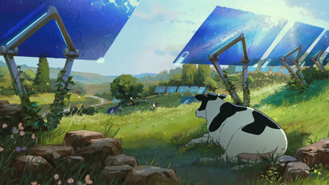

<!-- Banner Superior Animado -->

  

 

<!-- Título de Especialidades Animado (Efeito de Digitação Solarpunk) -->

  

 

<!-- Bloco 1: Perfil Profissional (Corrigido para preencher a célula) -->
<table align="center" style="border: none; background-color: transparent;">
  <tr style="border: none;">
    <td width="25%" style="border: none;">
      <!-- Sugestão: Suba um GIF sutil (ex: folhas se mexendo, engrenagens verdes) como avatar -->
      
    </td>
    <td align="left" width="75%" style="border: none;">
      <h2>Gabriel Vitório</h2>
      

        Atuo como <b>Analista de Suporte</b>, especializado na resolução ágil de incidentes, <i>troubleshooting</i> complexo e na garantia de estabilidade de sistemas críticos. 
      

      

        Aliado à minha forte base operacional, possuo sólidos fundamentos em <b>Desenvolvimento de Software e Engenharia de Dados</b>. Minha abordagem profissional une a visão técnica da infraestrutura de TI à capacidade de gerenciar, estruturar e analisar dados para construir arquiteturas e aplicações mais resilientes. Foco em processos estruturados, código escalável e entrega de valor alinhada às melhores práticas de mercado.
      

    </td>
  </tr>
</table>

 

<!-- Bloco 2: Arquitetura de Conhecimento -->
<h3 align="center">🛠️ Tecnologias & Ferramentas</h3>

  
<b>Suporte & Infraestrutura</b>

  
  
  
  
  
  
<b>Engenharia de Dados & Análise</b>

  
  
  
  

  
<b>Desenvolvimento de Software</b>

  
  
  

 

<!-- Bloco 3: Além do Código (Refinado) -->
<table align="center" style="border: none; background-color: transparent;">
  <tr style="border: none;">
    <td align="left" width="75%" style="border: none;">
      <h3>Um pouco mais sobre mim</h3>
      

        Gosto da ideia solarpunk porque acredito que a natureza e a tecnologia andam lado a lado. Esse equilíbrio é essencial para o futuro. 🌱
      

       
      <b>Conexões Profissionais:</b> 
      
      
    </td>
    <td align="center" width="25%" style="border: none;">
      <!-- Sugestão: GIF pequeno de engrenagem girando ou elemento da natureza -->
      
    </td>
  </tr>
</table>

 

<!-- Bloco 4: Gráfico Animado (A "Snake" com paleta verde-folha) -->

  <picture>
    <source media="(prefers-color-scheme: dark)" srcset="https://raw.githubusercontent.com/Gabrielvitori/Gabrielvitori/output/github-contribution-grid-snake-dark.svg">
    <source media="(prefers-color-scheme: light)" srcset="https://raw.githubusercontent.com/Gabrielvitori/Gabrielvitori/output/github-contribution-grid-snake.svg">
    
  </picture>

 

<!-- Bloco 5: Estatísticas (Widgets estilizados na estética Solarpunk) -->
<h3 align="center">Métricas e Entregas</h3>

  <!-- Stats e Top Languages (Bordas esmeralda, detalhes dourados) -->
  
  
  

  <!-- Streak (Chama dourada, anel verde) -->
  

 

  
<b>"Tecnologia sustentável gera sistemas resilientes." ☀️</b>

